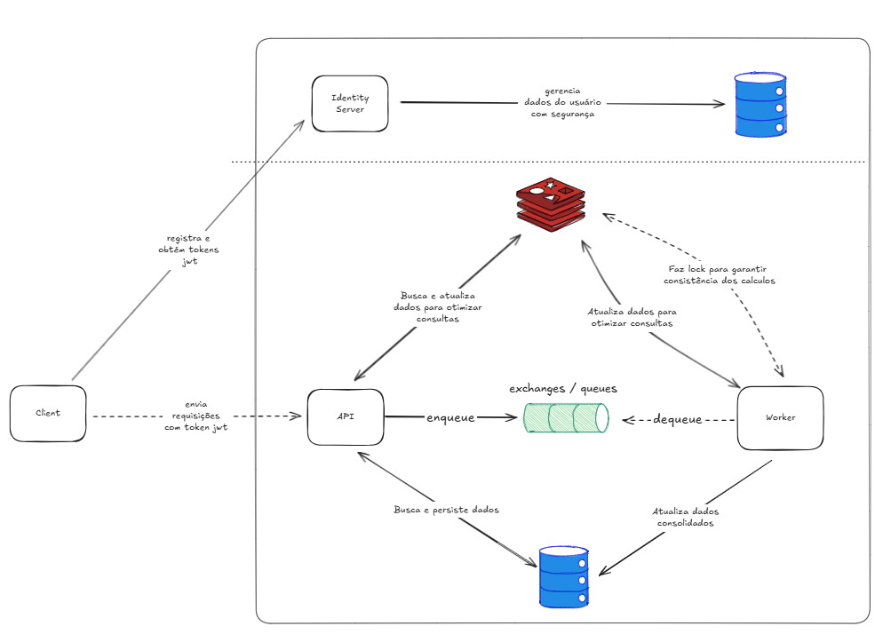

# Cash Flow

Solução para gestão de fluxo de caixa atraves de lançamentos de entrada e saida de valores e consulta de saldos atualizados.

##  Índice

- [Cash Flow](#cash-flow)
  - [Índice](#índice)
  - [Diagrama de Solução](#diagrama-de-solução)
  - [Tecnologias e Frameworks](#tecnologias-e-frameworks)
  - [Como executar](#como-executar)
    - [Via Docker](#via-docker)
    - [Via Dotnet Aspire](#via-dotnet-aspire)

## Diagrama de Solução



Um serviço de **Client** deve buscar se registar e fazer login no Identity Server para obter token JWT para enviar requisições para API do CashFlow.

A **Api** é responsável por validar se as chamadas estão autorizadas e se integrar com o cache, banco de dados e bus de messageria.

O **Worker** consome filas do bus de messageria para processar dados que demandam maior poder de processamento de forma assincrona. Ele se integra com o cache e banco de dados.

## Tecnologias e Frameworks
- .NET 9 _(pré-requisito)_
- Docker Desktop ou Rancher Desktop _(pré-requisito)_
- Aspire _(pré-requisito)_
- Identity Server
- RabbitMq
- Redis
- PostgreSql

## Como executar 
```bash
git clone https://github.com/souzagustavo/desafio-arquitetura-software.git

cd desafio-arquitetura-software
```
### Via Docker
```bash
docker-compose up --build
```

### Via Dotnet Aspire
```bash
cd .\CashFlow.AppHost\

dotnet run
```
