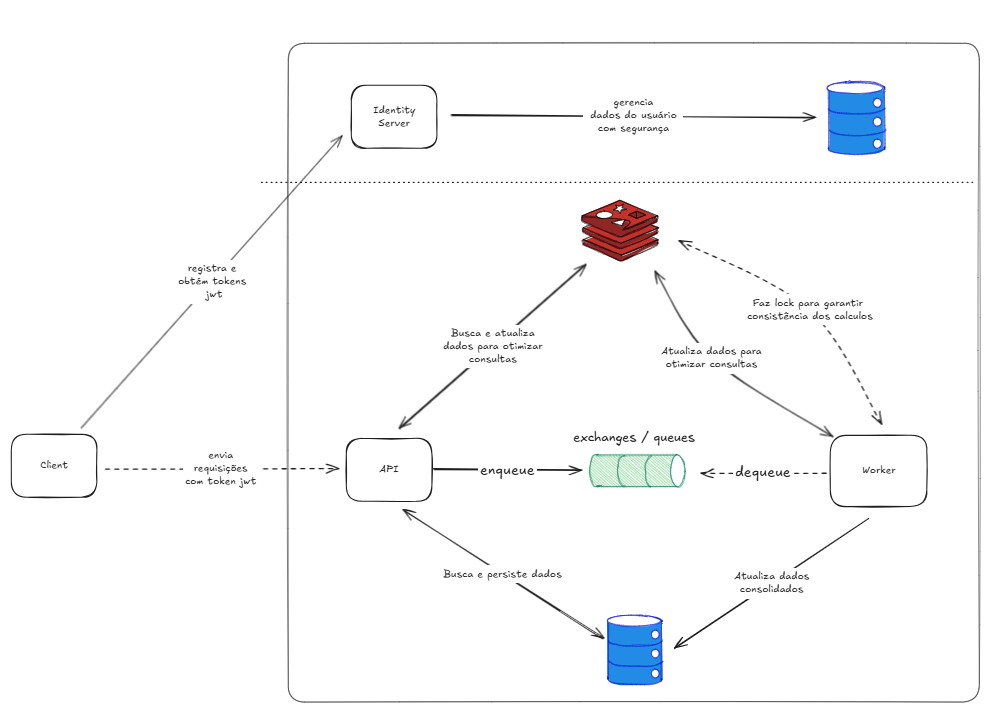
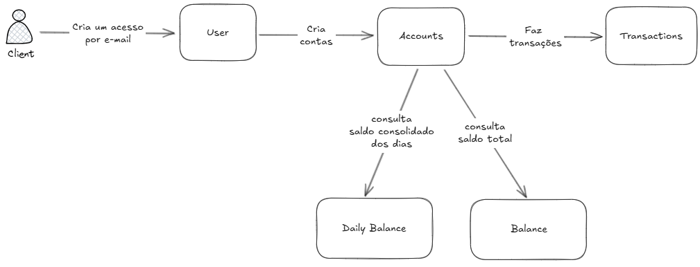
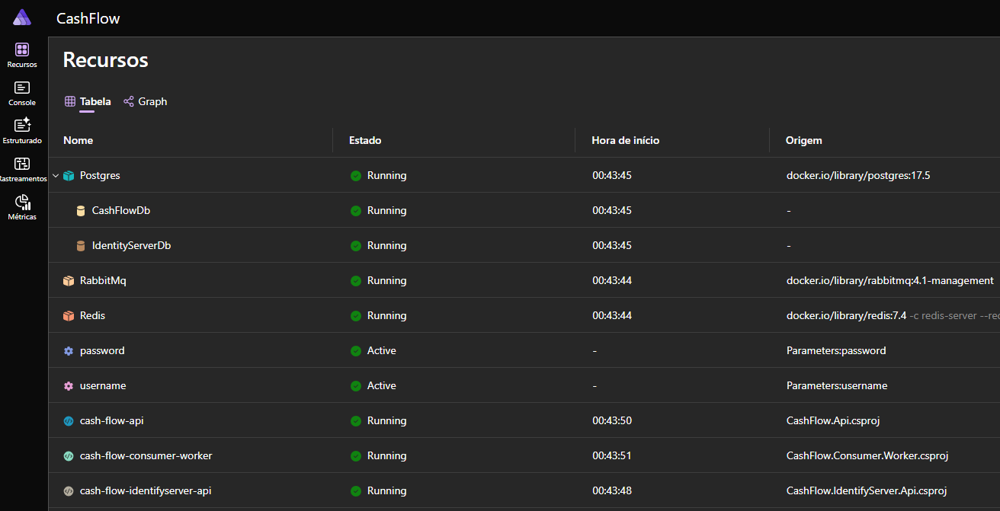
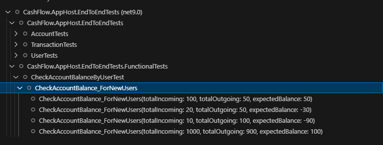
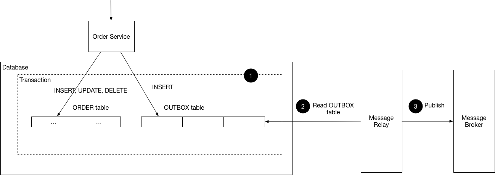

# Cash Flow

Solução para gestão de fluxo de caixa atraves de lançamentos de entrada e saida de valores e consulta de saldos atualizados.

##  Índice

- [Cash Flow](#cash-flow)
  - [Índice](#índice)
  - [Diagrama de Solução](#diagrama-de-solução)
  - [Fluxo de negócio](#fluxo-de-negócio)
  - [ADRs](#adrs)
  - [Tecnologias e Frameworks](#tecnologias-e-frameworks)
  - [Como executar](#como-executar)
    - [Via Dotnet Aspire](#via-dotnet-aspire)
  - [Testes](#testes)
  - [Próximos passos](#próximos-passos)
    - [Execução migrations em pipeline](#execução-migrations-em-pipeline)
    - [Criar serviço de Jobs](#criar-serviço-de-jobs)
    - [Implementação de Outbox](#implementação-de-outbox)

## Diagrama de Solução



Um serviço de **Client** deve buscar se registar e fazer login no Identity Server para obter token JWT para enviar requisições para API do CashFlow.

A **Api** é responsável por validar se as chamadas estão autorizadas e se integrar com o cache, banco de dados e bus de messageria.

O **Worker** consome filas do bus de messageria para processar dados que demandam maior poder de processamento de forma assincrona. Ele se integra com o cache e banco de dados.

## Fluxo de negócio



## ADRs

As documentações de ADRs estão [aqui](./adrs/)

## Tecnologias e Frameworks
- .NET 9 _(pré-requisito)_
- Docker Desktop ou Rancher Desktop _(pré-requisito)_
- Aspire _(pré-requisito)_
- Identity Server
- RabbitMq
- Redis
- PostgreSql

## Como executar 
```bash
git clone https://github.com/souzagustavo/desafio-arquitetura-software.git

cd desafio-arquitetura-software
```

### Via Dotnet Aspire
_Necessário iniciar ferramenta de Docker_
```bash
cd .\src\CashFlow.AppHost\

dotnet run
```


Acesso as documentações das Apis
| Url      | Service |
|----------|---------|
|https://localhost:7298/swagger | Identity Server Api |
|https://localhost:7114/swagger | CashFlow Api |

## Testes
Para validar a arquitetura e integração dos componentes foram implementados testes e2e utilizando ```Aspire.Hosting.Testing```.
_Necessário iniciar ferramenta de Docker_
```bash
cd  \tests\CashFlow.AppHost.Tests\

dotnet test
```
Principal cenário de teste que garante transações e saldo atualizado corretamente.



## Próximos passos

### Execução migrations em pipeline
Adicionar na pipeline de deploy tasks para executar migrations do ef core.

Atualmente os serviços de Api são responsáveis por executar as migrações durante o startup, podendo gerar conflitos de DDL ao escalar horizontalmente o serviço.

O EF Core possui o bundle.exe que pode ser utilizado para essa abordagem.

https://learn.microsoft.com/en-us/ef/core/managing-schemas/migrations/applying?tabs=dotnet-core-cli#bundles

### Criar serviço de Jobs 
Criar serviço de CashFlow.Jobs.Worker com Hangfire para execução de rotinas recorrentes e agendadas como:

- Processamento de transações pendentes criadas á 2h atrás e que ainda não foram processadas
- Envio de relatórios diários por e-mail 
- Criação de transações automaticamente baseada em uma configuração do usuário.

### Implementação de Outbox
Padrão que resolve a inconsistência de dados entre uma operação de base de dados e a publicação de um evento em um sistema de mensageria, garantindo que ambos ocorram atomicamente ou sejam executados e processados de forma confiável.



Atualmente o serviço de Api publica diretamente no RabbitMq, podendo ter perca de processamento das transações de fluxo de caixa.
