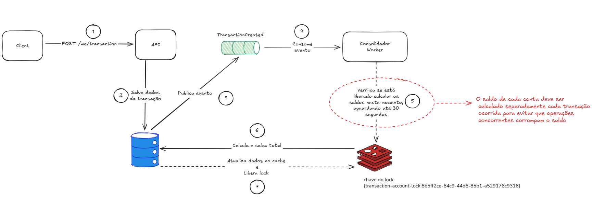

# Title

Consolidação de saldos das transações

## Status

Implementada

## Context

O sistema precisa disponibilizar os valores consolidados de saldo geral e saldo diário em real-time para o usuário por se tratar de uma informação critica e estremamente importante.

## Decision

Os dados de toda transação criada terão que ser publicado no RabbitMq na exchange "TransactionCreated"

Dessa forma o serviço Worker atraves de um bind queue na exchange poderá consumir a mensagem e fazer o calculo de saldo total e saldo diário com base no tipo de transação, seja de entrada ou saida.

Após o calculo as informações devem ser atualizadas no banco de dados e no cache conforme a sua chave determinada.

Com essa abordagem podemos paralelizar o processamento das consolidações com escala horizontal de workers.

## Consequences
Por conta do paralelismo de processamento temos que evitar que duas transações da mesma conta seja processada ao mesmo tempo. 

Com isso foi implementada uma estratégia de redlock que visa garantir atraves do Redis que o inicio e o fim de cada calculo de transação seja feito de cada vez.

Para esse cenário é recomendado ter uma estratégia de fallback para caso o serviço worker esteja indisponivel. 